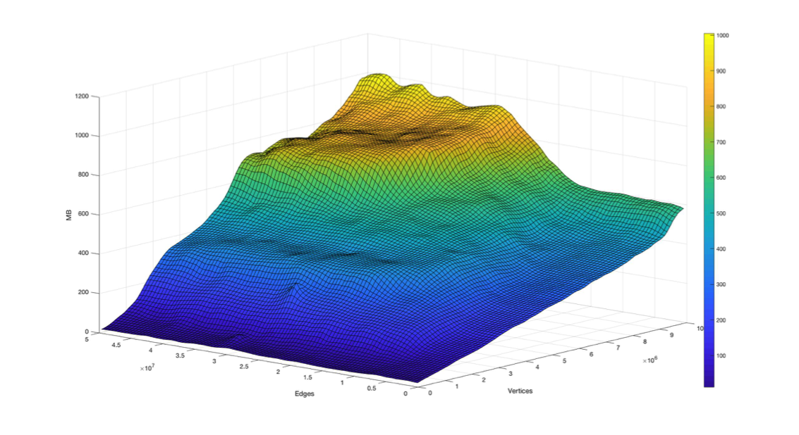
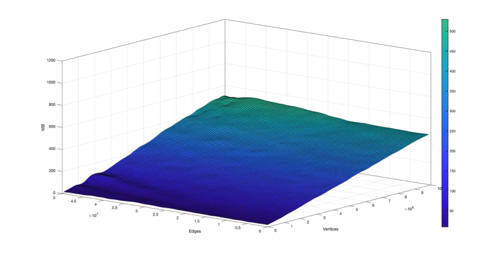

# SSCAlgorithm
Project for the Advanced Algorithm and Parallel Programming course Polimi 2018.
## Description

C++ Implementation of some algorithms for finding the Strongly Connected Components (SCCs) in a directed graph that fit into the main memory.

For a directed graph D = (V, E), a Strongly Connected Component (SCC) is a maximal induced subgraph S = (VS, ES) where, for every (x, y) ∈VS, there is a path from x to y (and vice-versa).

[Image]

## Algorithms

### 1 - Pearce algorithm
Iterative algorithm that lower the spatial complexity of the Tarjan algorithm by avoiding using not essential resources.

    Time complexity: O(|V| + |E|)
    Space complexity: O(|V| ∙ (1 + 3w))

The algorithm has ben slightly modified to support all the containers for *adjacency_list* and *adjacency_matrix*.

##### Performances
- Time: Similar to the BGL implementation, on average the new algorithm run 5.2% faster than the BGL implementation on test samples;

- Space: The new algorithm use less memory than the BGL implementation
BGL Algorithm

Pearce Implementation

##### Bottleneck
95% of the execution time inside two functions:
- Boost::get
- Boost::put

For better time performances use an array instead of a map for the output.

### 2 - Nuutila algorithm
Recursive algorithm that lower the required memory of the Tarjan algorithm by avoiding not necessary work and storing only root vertices.

    Time complexity: O(|V| + |E|)
    Space complexity: O(|V| ∙ (1 + 4w))

##### Performances
- Time: Significantly faster than the BGL implementation
[img]

- Space: TODO
[img]

##### Bottleneck
Execution of the DFS with the DFSVisitor (80% of the time); for better time performance simulate the recursion with two stacks as for Pearce.

## Known Issues
- Not able to define a GBL graph as *adjacency_list* and multimapS as container for *outEdgeList*
