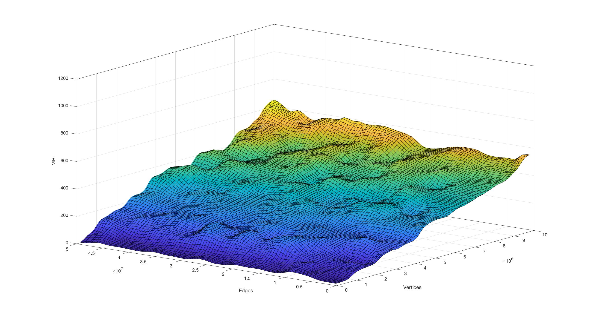

# SSCAlgorithm
Project for the Advanced Algorithm and Parallel Programming course Polimi 2018.
## Description

C++ Implementation of some algorithms for finding the Strongly Connected Components (SCCs) in a directed graph that fit into the main memory.

For a directed graph D = (V, E), a Strongly Connected Component (SCC) is a maximal induced subgraph S = (V, E) where, for every (x, y) ∈ V, there is a path from x to y (and vice-versa).

## Algorithms

### 1 - Pearce algorithm
Iterative algorithm that lower the spatial complexity of the Tarjan algorithm by avoiding using not essential resources.

    Time complexity: O(|V| + |E|)

    Space complexity: O(|V| ∙ (1 + 3w))

The algorithm has ben slightly modified to support all the containers for *adjacency_list* and *adjacency_matrix*.

##### Bottleneck
Same problem of BGL implementation, 95% of the execution time inside two functions:
- Boost::get
- Boost::put

For better time performances use an array instead of a map for the output.

### 2 - Nuutila algorithm
Recursive algorithm that lower the required memory of the Tarjan algorithm by avoiding not necessary work and storing only root vertices.

    Time complexity: O(|V| + |E|)

    Space complexity: O(|V| ∙ (1 + 4w))

##### Bottleneck
Execution of the DFS with the DFSVisitor (80% of the time); for better time performance simulate the recursion with two stacks as for Pearce.

# Performances:
Performances evaluated with adjacency_list and VecS as OutEdgeList and VertexList.

- **Pearce**:
    - Time: Similar to the BGL implementation, on average the new algorithm run 5.2% faster than the BGL implementation on test samples.
    
    

    - Space: The implementation use far less memory than the BGL implementation and similar memory to the Nuutila implementation.
    

- **Nuutila**:
    - Time: Significantly faster than the BGL implementation.
    
    

    - Space: Similar memory consumption to the pearce implementation.
    

- **BGL Implementation**:
    - Time:
    
    

    - Space:
    

## Known Issues
- No test to check *adjacency_list* and multimapS as container for *OutEdgeList*
